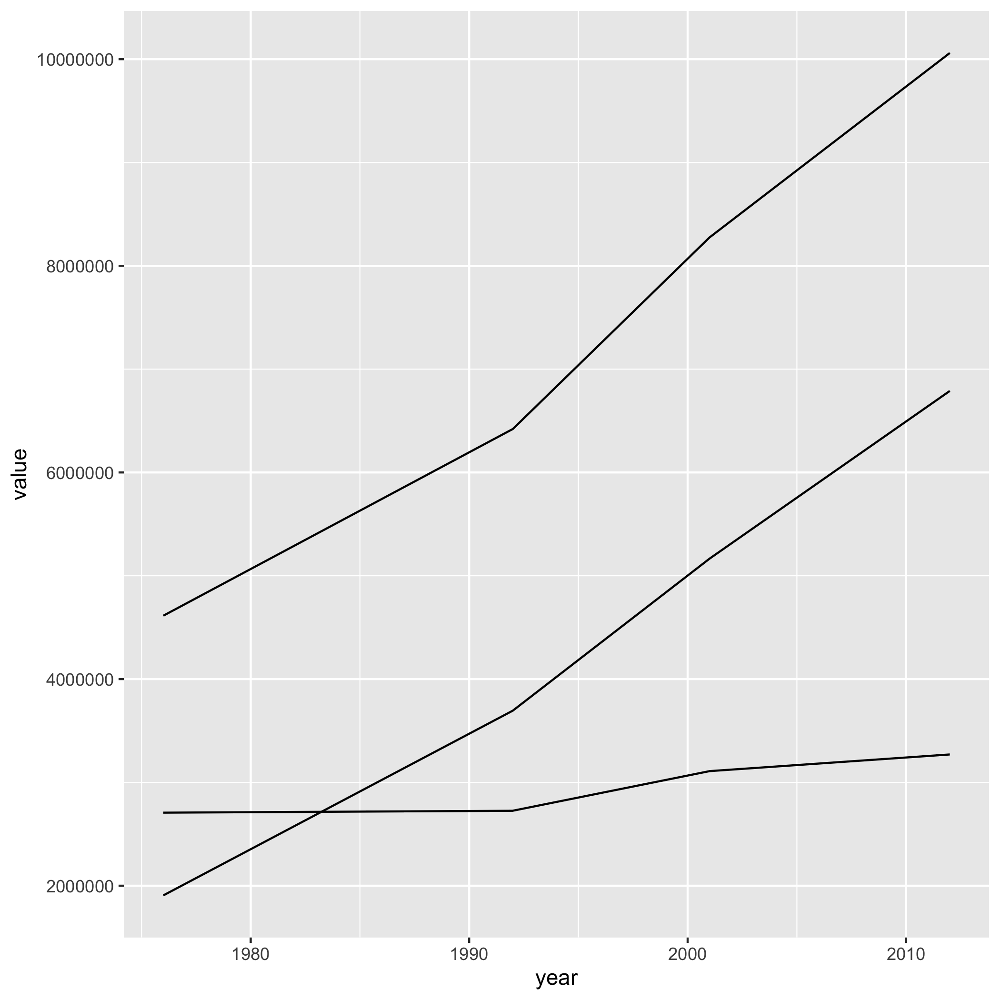
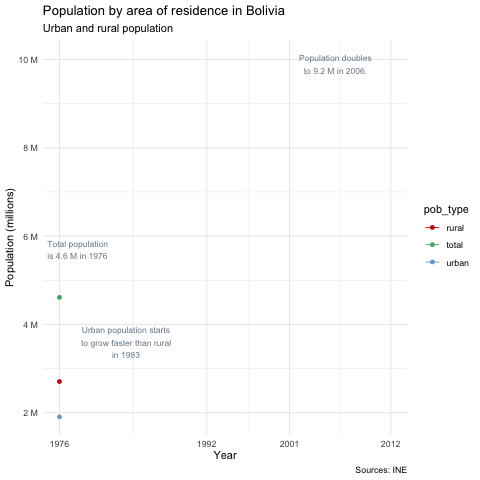

```{r setup, include=FALSE}
knitr::opts_chunk$set(echo = FALSE,
                      warning = FALSE,
                      message = FALSE)
```

## What is R?
- R is a free software environment for statistical computing and graphics. 
- Used for data analysis and statistical software.
  + Created by statisticians _**Ross Ihaka**_ and _**Robert Gentleman**_ at the University of Auckland in 1992. 
  + Meets needs of statisticians to **analyze data and produce graphical models**. 
- **RStudio** is a free, open-source Integrated Development Environment (IDE), the most common third-party UI. 
  + It provides a **built-in editor, version control, project management, and it works on all platforms**. 

## What is data science?
- Data science is a multidisciplinary approach to extracting insights from data.
  + **Research, math, statistics, programming, analytics, AI.**
- **Cleansing**, aggregating and manipulating data.
- **Analysis** (statistics, algorithms, analytics, AI models, machine learning and deep learning models, etc.). 
- Find **patterns and insights**, and transform them into insights. 
  + Validated through the **scientific method**.
- Results are shared through **data visualization** to see patterns and understand trends. 

## R in Data Science 
- Similar to other programming languages for computing tasks (C, Java and Perl) .  
- Built-in statistical mechanisms.
- **Freeware** Available at no charge under a free software license:
  + Unlike other commercial statistical tools (SAS, SPSS, Stata).
- **Packaging system**: main driver for popularity. 
  + **Increased R functions**.
  + Offers **ready-to-use statistical techniques, graphical devices, import/export, reporting, etc**. 

## Tydiverse
- Group of packages, one of the most popular among data scientists. 
  + **Collection of functions** (data import, cleaning, transformation, interactive and dynamic visualization).
  + **Easy start with data science tasks** (instead of writing algorithms from scratch). 

## Shortcomings
- R vs. Python: free to download, data manipulation, automation, data exploration.

- **Python**:
  + Better suited for scalable production environments.
  + General-purpose programming language (many uses along with data science and statistics). 
- **R**:
  + Optimized for statistics and analysis. 
  + Packages to make more customizable graphs.

## R vs. Python
| R is better for...                          | **Python is better for...**                                    |
| :------------------------------------------:|:---------------------------------------------------------:|
| Creating graphs and visualization           | **Handling large amounts of data**                        |
| Building statistical models                 | **Building deep learning models**                         |
| Its robust ecosystem of statistical packages| **Non-statistical tasks (web scraping, saving databases)**|

## Source data
```
Año, Población Total, Población urbana, Población rural
1976,4613419,1906324,2707095
1992,6420792,3694846,2725946
2001,8274325,5165230,3109095
2012,10059856,6788962,3270894
```
## Simple plot
```{r, out.width = '68%', fig.align='center'}

```

## Animated plot
```{r, out.width = '68%', out.height='100%' , fig.align='center'}

```
